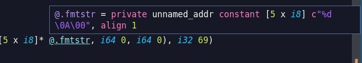
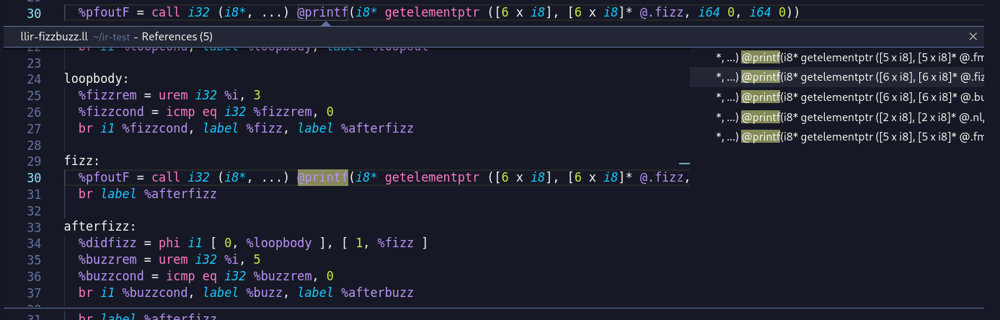
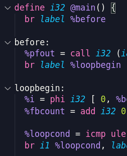

# LLVM IR Language Support

This extension adds language support features for LLVM IR files (`.ll`)

## Features

-   `Go to Definition` for variables, attributes and metadata with line preview

    

-   `Go to References` for variables, attributes and metadata

    

-   Folding ranges for functions and labels

    
